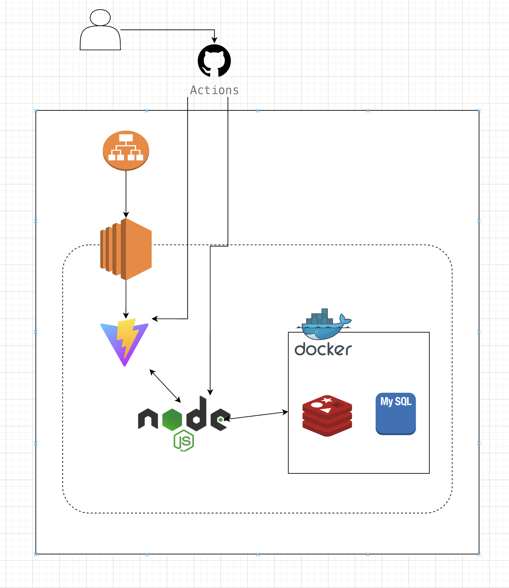
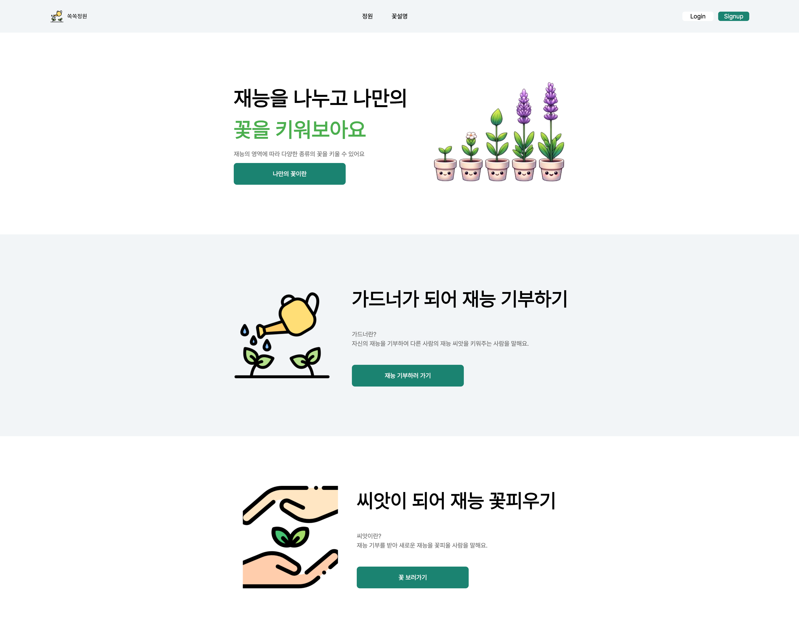
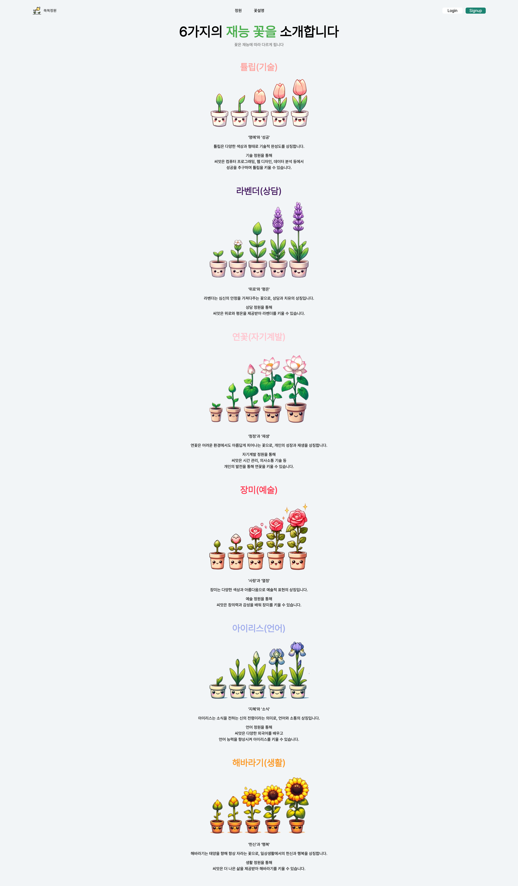
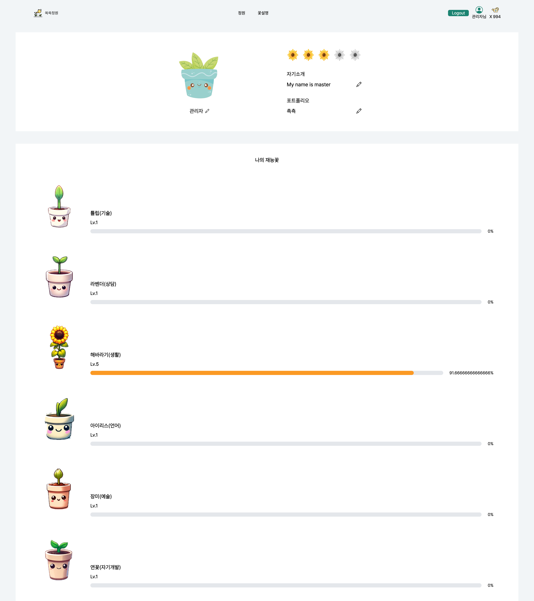
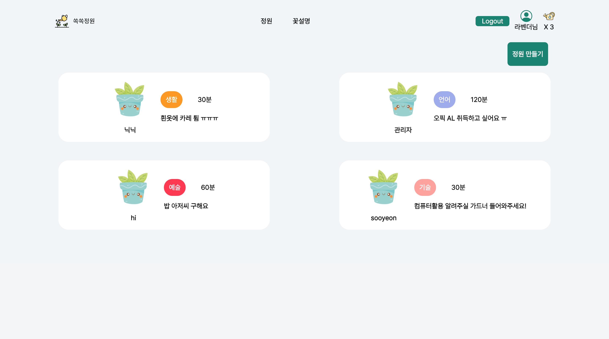
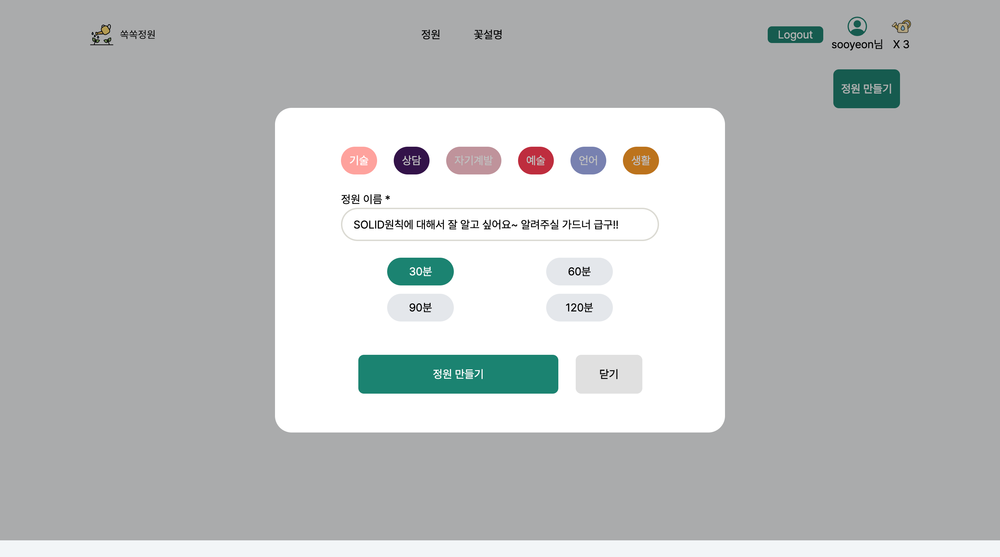

# 🌱쏙쏙정원🌱


## 📅 프로젝트 개요

🌱 **기간**

2024.05.22 ~ 2024.05.25 - 기획 (4일)  
 2024.05.26 ~ 2024.05.31 - 개발 (6일)

🌱 **창조주 팀원 소개**

<table>
    <tr>
        <td></td>
        <td></td>
        <td></td>
    </tr>
    <tr align=center>
        <td><a href='https://github.com/subsub97'>김득호</a></td>
        <td><a href='https://github.com/hyuna333'>김현아</a></td>
        <td><a href='https://github.com/sooyeon-kr'>오수연</a></td>
    </tr>
    <tr align=center>
        <td>백엔드 / 프론트 </td>
        <td>프론트 / 백엔드 </td>
        <td>백엔드 / 프론트</td>
    </tr>
</table>

🌱 **기획 배경**

-   `쏙쏙정원`은 재능을 주고 받을 수 있는 `1:1` 웹 기반의 화상 서비스 입니다.
-   사람은 누구나 재능을 소유하고 있습니다.  
    `쏙쏙정원`에서는 자신의 재능을 알려주고 나눠주는 사람을 `가드너(Gardener)` 라고 합니다. 이러한 `가드너`에게 `물뿌리개`를 건네줌으로써, 재능을 배울 수 있는 사람을 `새싹`이라고 합니다.
-   재능을 주고 받음으로써, `재능씨앗`을 키워보세요!
    ​
    <br>

🌱 **핵심 기능**

-   `socket.io`, `webRTC`를 활용한 화상 회의 기능
-   `6가지` 종류의 재능 씨앗 키우기 기능
-   `물뿌리개` 교환 기능
    -   `회원가입`시, 3개 기본 제공
-   `가드너` 평가(리뷰 점수 부여) 기능

## 💡서비스 소개

### _🌱쏙쏙정원_

> 쏙쏙정원은, 웹 기반의 재능 나눔 화상 서비스 입니다.
>
> 1. 재능을 배우고 싶은 새싹이 정원을 만듭니다.  
>    (재능 카테고리 / 배우고 싶은 시간 / 정원 제목 입력)
>
> 2. 재능에 따라 씨앗을 길러주고 싶은 가드너는 정원 제목을 보고 참여합니다.
>
> 3. 가드너가 `준비하기` 버튼을 누르면, 새싹의 `시작하기` 버튼이 활성화됩니다.
>
> 4. 시작하면, 30분에 1개씩 계산하여, 새싹의 물뿌리개가 소모됩니다.
>
> 5. 재능나눔이 모두 완료되면, 새싹은 가드너에게 평점을 줍니다.
>
> 6. 가드너는 새싹이 소모한 물뿌리개만큼, 물뿌리개를 받습니다.
>
> 7. 새싹은 자신의 씨앗 점수를 얻어, 레벨을 올립니다.

**마음껏 재능을 배우고, 씨앗을 키워 꽃을 피워보세요🌼**

### 꽃 종류

|    꽃    | 카테고리  |      꽃말       |
| :------: | :-------: | :-------------: |
| 해바라기 | 생활 정원 | '헌신'과 '행복' |
|   장미   |   예술    | '사랑'과 '열정' |
|   튤립   |   기술    | '명예'와 '성공' |
| 아이리스 |   언어    | '지혜'와 '소식' |
|   연꽃   | 자기계발  | '청정'과 '재생' |
|  라벤더  |   상담    | '위로'와 '평온' |

### ⚙️ 기술 스택


​

​

## 📂시스템 아키텍처



## 🖼 주요 화면

​

### 🌟 메인 화면


​

### 🌟 꽃 소개 화면


​

### 🌟 프로필 화면


​

### 🌟 정원 리스트 화면 - 빈 정원 / 정원 존재




### 🌟 정원 만들기 화면



## 🌟 정원 화면 - 새싹 관점


## 🌟 정원 화면 - 가드너 관점


### 🌟 정원 화면 - 재능 나눔 시작


​

### 🌟 평가 화면


### 🌟 회원 가입 화면 및 로그인 화면


## 컨벤션

### 📍 Git 컨벤션

```
<컨벤션> : <변경 파일 명> - <설명>
```

| 컨벤션   | 설명                                                                                                                            |
| -------- | ------------------------------------------------------------------------------------------------------------------------------- |
| feat     | 새로운 기능과 관련된 것을 의미한다.                                                                                             |
| fix      | 오류와 같은 것을 수정했을 때 사용한다.                                                                                          |
| docs     | 문서와 관련하여 수정한 부분이 있을 때 사용한다.                                                                                 |
| style    | 코드의 변화와 관련없는 포맷이나 세미콜론을 놓친 것과 같은 부분들을 의미한다.                                                    |
| refactor | 코드의 리팩토링을 의미한다.                                                                                                     |
| test     | test를 추가하거나 수정했을 때를 의미한다.                                                                                       |
| chore    | build와 관련된 부분, 패키지 매니저 설정 등 여러가지 production code와 무관한 부분 들을 의미한다. 말 그대로 자질구레한 일들이다. |
| add      | 이미지 등의 정적 자원 추가를 의미한다.                                                                                          |
| init     | 초기 설정 세팅을 의미한다.                                                                                                      |
| rename   | 파일 혹은 폴더 명을 수정하거나 옮기는 작업을 의미한다.                                                                          |
